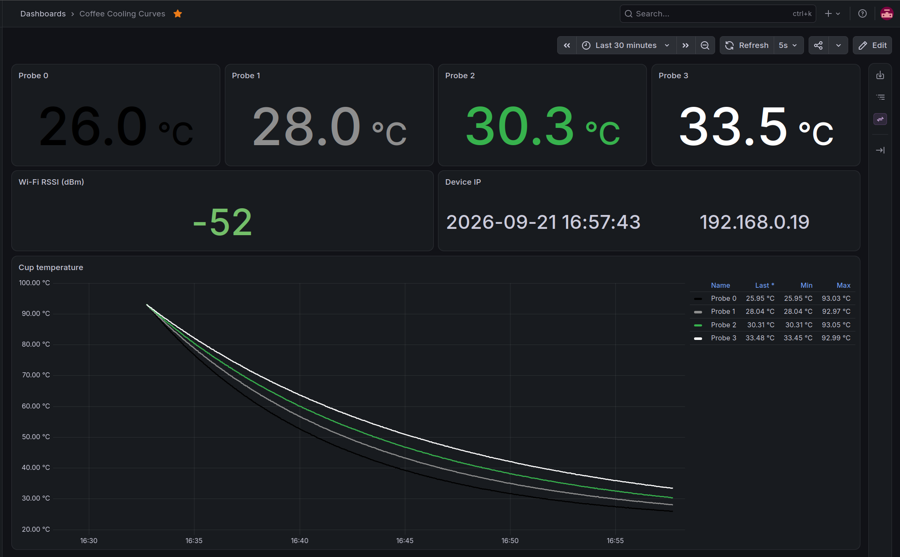

# esp32-coffee-thermometer

Real-time temperature monitoring setup for comparing 4 coffee cups simultaneously during a cupping session. Built to log and visualize cooling curves using an ESP32, 4x DS18B20 probes, MQTT, and Grafana.

Temperature drives what you actually taste: as a cup cools, perceived acidity and sweetness climb while bitterness recedes, so two coffees only compare fairly when they are tasted at the same point on their cooling curve. Logging that curve turns "taste it when it's ready" into something repeatable. Designed for James Hoffmann & Lucia Solis's [*The Fermentation Project*](https://www.thefermentationproject.com/) tasting experiment.



*A simulated session: the curves above were generated for the screenshot, not recorded from probes.*

---

## Hardware

- **MCU:** ESP32 DevKit (WiFi)
- **Sensors:** 4x DS18B20 waterproof probes (1m cable)
- **Adapter:** DS18B20 screw-terminal adapter module (includes 4.7kΩ pull-up resistor)
- **Connections:** 3x Female-Female DuPont wires

---

## Wiring

All 4 probes are connected in **parallel** into the adapter's screw terminals.

### 1. Probes to Adapter Terminal
- **Red wires** (VCC) -> `VCC` / `+`
- **Black wires** (GND) -> `GND` / `-`
- **Yellow/Green wires** (Data) -> `DAT` / `A`

### 2. Adapter to ESP32
- `VCC` -> `3V3` (or `VIN`)
- `GND` -> `GND`
- `DAT` -> `GPIO 4` (`D4`)

---

## Data Flow & MQTT Topics

The ESP32 connects to Wi-Fi and reads all 4 sensors on 1-Wire GPIO 4 every 2 seconds.

Metrics are published to the local MQTT broker:

- `coffee/sensor/0/temperature`
- `coffee/sensor/1/temperature`
- `coffee/sensor/2/temperature`
- `coffee/sensor/3/temperature`

Alongside the readings:

- `coffee/status` - retained `online` / `offline`, backed by an MQTT last
  will, so a stalled graph can be told apart from a board that dropped off
- `coffee/session/elapsed` - seconds since t=0, published each cycle
- `coffee/device/ip` - retained, the address the board was given
- `coffee/device/rssi` - link quality in dBm, published each cycle

Publishing anything to `coffee/session/start` resets t=0. Marking the pour
this way lets several cups be lined up on the same axis afterwards:

```bash
mosquitto_pub -h localhost -t coffee/session/start -n
```

---

---

## Architecture

```
ESP32  ──MQTT──▶  Mosquitto  ──▶  Telegraf  ──▶  InfluxDB  ◀──  Grafana
 probe            transport       collector        storage        display
```

Five pieces, because no two of them do the same job.

### Why a broker at all

The ESP32 could write to a database directly, but then the firmware would
carry database credentials, a schema, and retry logic for a host that might
be down. MQTT keeps the board's job small: connect, publish four numbers,
forget them. Anything else that wants the readings subscribes, without the
firmware knowing it exists.

### Why MQTT is not enough

A broker **forwards and forgets**. It holds no history: whatever is not
subscribed at the moment a message arrives is gone for good. Retained
messages are the one exception, and they keep only the latest value per
topic, which is why `coffee/status` and `coffee/device/ip` use them.

For a cooling curve that is fatal. The whole point is the shape of the
curve over twenty minutes, and comparing this session against one from a
month ago. Both need the readings to still exist after they arrive.

### Why InfluxDB

A time series database stores timestamped numbers and answers questions
like "mean per 10s window over the last hour" cheaply. That is exactly the
shape of this data, and exactly what the dashboard asks for on every
refresh.

A plain SQL table would also work at this volume - four probes every two
seconds is trivial - but the downsampling the graph needs would then be
hand-written SQL. The Flux queries in the dashboard are three lines.

### Why Telegraf

Something has to subscribe to MQTT and write to InfluxDB. Telegraf is a
config file rather than a program to maintain:

```toml
[[inputs.mqtt_consumer.topic_parsing]]
  topic = "coffee/sensor/+/temperature"
  tags = "_/_/probe/_"
```

Those three lines turn `coffee/sensor/2/temperature` into a point tagged
`probe=2`. That tag is what lets one dashboard query draw four separate
curves instead of one averaged line.

### Why not the Grafana MQTT plugin

Grafana has an MQTT datasource plugin, and it would remove two containers
from this stack. It streams live only - it shows what has arrived since the
panel was opened, and keeps nothing. Refresh the page mid-session and the
first half of the curve is gone, and yesterday's tasting was never
recorded at all.

Live-only is fine for watching a value move. It cannot answer "was this
cup cooler than the one last week", which is the question the whole
project exists to answer.

## Quickstart

### 1. Flash the ESP32
1. Open `coffee_thermometer/coffee_thermometer.ino` in **Arduino IDE**.
2. Install the ESP32 core: Boards Manager -> *esp32* by Espressif Systems.
3. Install required libraries: `OneWire`, `DallasTemperature`, `PubSubClient`.
4. Copy `coffee_thermometer/config.example.h` to
   `coffee_thermometer/config.h` and fill in the Wi-Fi and broker values.
   `config.h` is git-ignored and stays on your machine.
5. Select the board and settings below, then upload (`/dev/ttyUSB0` on Ubuntu).

Board: **ESP32 Dev Module** (`esp32:esp32:esp32`). The named presets such as
*DOIT ESP32 DEVKIT V1* target 30-pin clones and map pins differently.

| Setting | Value |
| --- | --- |
| Flash Size | 4MB (32Mb) |
| PSRAM | Disabled |
| Flash Mode | QIO |
| Partition Scheme | Default 4MB with spiffs |
| CPU Frequency | 240MHz |
| Upload Speed | 921600 |

PSRAM must stay disabled - the WROOM-32 module has none, and enabling it boot
loops. Drop the upload speed to `115200` if flashing fails partway.

### 2. Sensor Identification
Open Serial Monitor at `115200` baud. Hold one probe in your hand to see which sensor index (`0-3`) spikes in temperature, then label that physical probe.

### 3. Spin Up Services
```bash
docker compose up -d
```

This starts four containers:

- **`coffee-mqtt`** - Mosquitto broker on port `1883`
- **`coffee-influxdb`** - stores the readings, port `8086`
- **`coffee-telegraf`** - subscribes to the topics and writes them to InfluxDB
- **`coffee-grafana`** - Grafana on port `3000`

Copy `.env.example` to `.env` and fill in the InfluxDB credentials before
the first start. See [Architecture](#architecture) for what each container
is doing there.

Broker settings live in `mosquitto/config/mosquitto.conf`. The listener is
anonymous, which is fine on a trusted LAN and not fine on anything exposed to
the internet.

### 4. Verify the Data
With the ESP32 powered on, subscribe to every sensor topic at once:

```bash
mosquitto_sub -h localhost -t 'coffee/sensor/#' -v
```

Readings should appear every 2 seconds, one line per probe.

---

## Repository Layout

```
.
├── coffee_thermometer/
│   ├── coffee_thermometer.ino
│   └── config.example.h
├── grafana/
│   ├── dashboards/
│   │   └── cooling-curves.json
│   └── provisioning/
│       ├── dashboards/
│       └── datasources/
├── mosquitto/
│   └── config/
│       └── mosquitto.conf
├── telegraf/
│   └── telegraf.conf
├── .env.example
└── docker-compose.yml
```

